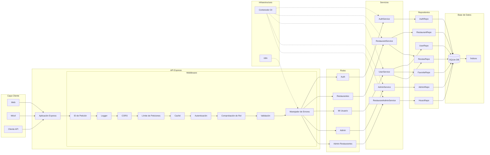
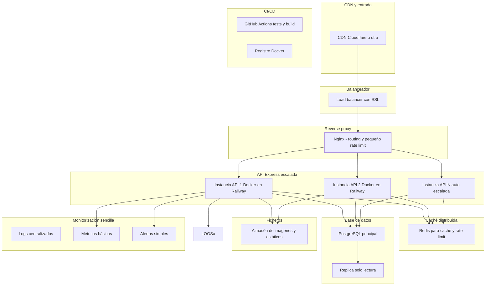

# Arquitectura de la Aplicación - Tailor Restaurants API

## Diagrama 1: Arquitectura Actual

## Diagrama 2: Arquitectura Escalada (100k usuarios/semana)

# Explicación de cada componente de la arquitectura escalada

A continuación se explica la función concreta de cada bloque del diagrama de escalado.

## CDN (Cloudflare)
CDN que entrega archivos estáticos (imágenes, CSS, JS) desde ubicaciones cercanas al usuario.  
Reduce latencia y carga en la API.

## WAF (Protección DDoS)
Firewall de aplicaciones que filtra tráfico malicioso, bloquea bots y protege contra ataques antes de que lleguen al backend.

## Load Balancer (con SSL)
Reparte el tráfico entrante entre varias instancias de la API Express.  
Además termina el SSL, descargando al backend del trabajo de cifrado/descifrado.

## Nginx (Reverse Proxy)
Proxy ligero delante de las instancias de la API que se encarga de:
- Routing limpio
- Compresión de respuestas
- Pequeño rate limit
- Mejor gestión de conexiones concurrentes

## Instancia API 1 (Docker en Railway)
Primera instancia de la API Express empaquetada con Docker y desplegada en Railway.  
Atiende parte del tráfico recibido por el load balancer.

## Instancia API 2 (Docker en Railway)
Segunda instancia idéntica que trabaja en paralelo.

## Instancia API N (Auto-escala)
Instancias adicionales que Railway/infra añade automáticamente durante picos de tráfico (auto-scaling horizontal).

## Redis (Cache y Rate Limit)
Sistema de almacenamiento en memoria compartido entre todas las instancias para:
- Cachear respuestas frecuentes
- Guardar el estado del rate limiting
- Reducir la presión sobre la base de datos

## PostgreSQL Principal
Motor relacional pensado para producción y carga concurrente. Sustituye a SQLite porque:
- Permite múltiples escrituras en paralelo sin bloquear toda la BBDD
- Ofrece replicación, backups consistentes y planes de ejecución más eficientes

## Réplica (Solo Lectura)
Copia sincronizada del PostgreSQL principal.  
Las lecturas intensivas (restaurants list, reviews, stats…) pueden ir aquí para no saturar el servidor principal.

## S3 / Almacén de imágenes
Servicio de almacenamiento donde se guardan:
- Fotografías de restaurantes
- Assets estáticos
- Backups

Evita saturar el servidor de aplicación con ficheros grandes.

## Workers (Background Jobs)
Procesos separados que consumen tareas de la cola y las ejecutan.  
Permiten que la API responda rápido sin esperar a trabajos pesados.

## Logs Centralizados
Servicio donde todas las instancias envían logs de:
- Errores
- Performance
- Peticiones

Facilita depuración cuando hay varias instancias.

## Métricas (Prometheus)
Colección de métricas básicas de salud:
- CPU
- RAM
- Latencia
- Throughput

## Alertas (Slack/Email)
Sistema de alertas que avisa automáticamente cuando:
- La API empieza a fallar
- Sube mucho la latencia
- Aumenta la tasa de errores

## GitHub Actions (CI)
Pipeline de integración continua que ejecuta:
- Tests
- Análisis estático
- Build del proyecto

## Docker Registry
Registro donde se suben las imágenes Docker generadas por la CI.  
Railway o la plataforma de despliegue toma las imágenes desde aquí para lanzar nuevas versiones de la API.